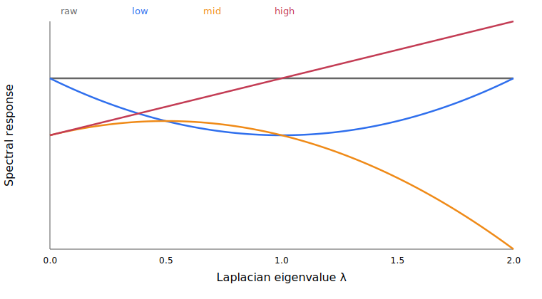

# Spectral correctness report

| Check | Maximum absolute error | Threshold | Result |
|---|---:|---:|---|
| Sparse Zhou vs dense formula | 0.000e+00 | 1e-5 | PASS |
| Chebyshev vs eigendecomposition | 0.000e+00 | 1e-5 | PASS |

The ordinary-graph response plot is derived directly from `S=I-L`, `low=S²X`, `mid=SX-S²X`, and `high=X-SX`.

